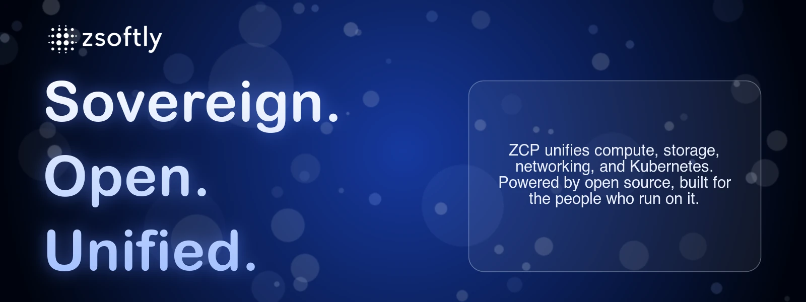

<div align="center">



**AI & Cloud-First IT Solutions.** Sovereign cloud, billing, and platform in one place — built for
the people, by the people.

[](https://zcp.zsoftly.ca)
[](https://cloud.zcp.zsoftly.ca)
[](https://docs.zcp.zsoftly.ca)

</div>

---

## What we build

**ZSoftly Cloud Platform (ZCP)** is a sovereign public cloud. It gives you compute, storage,
networking, Kubernetes, and an S3-compatible object store, with unified billing and a single control
plane. We also operate private cloud (ZPCP) for teams that need a dedicated, sovereign stack.

We ❤️ open source. Our platform is built on open foundations, and we develop and share our own tools
in the open. Our public projects:

| Project                                                                         | What it is                                                           |
| ------------------------------------------------------------------------------- | -------------------------------------------------------------------- |
| [**zcp-cli**](https://github.com/zsoftly/zcp-cli)                               | Official command-line interface for the ZSoftly Cloud Platform (Go). |
| [**zcp-docs**](https://github.com/zsoftly/zcp-docs)                             | Product documentation for ZCP, English and French.                   |
| [**terraform-provider-zcp**](https://github.com/zsoftly/terraform-provider-zcp) | Terraform / OpenTofu provider for managing ZCP resources as code.    |

## Get started

- **Try the platform:** [cloud.zcp.zsoftly.ca](https://cloud.zcp.zsoftly.ca). Sign up and deploy in
  minutes.
- **Read the docs:** [docs.zcp.zsoftly.ca](https://docs.zcp.zsoftly.ca). Guides, CLI reference, and
  tutorials (bilingual).
- **Use the CLI:**
  ```bash
  curl -fsSL https://raw.githubusercontent.com/zsoftly/zcp-cli/main/scripts/install.sh | bash
  zcp profile add default
  ```

## Contributing & feedback

Our docs and tools are open source. The fastest way to help is to
**[open an issue](https://github.com/zsoftly/zcp-docs/issues)** or email
**docs-support@zsoftly.ca**. Each repo's `CONTRIBUTING.md` explains how we review and ship changes.

## Connect

[Website](https://zcp.zsoftly.ca) ·
[LinkedIn](https://www.linkedin.com/company/zsoftly-technologies) ·
[Documentation](https://docs.zcp.zsoftly.ca) · info@zsoftly.ca

<div align="center">

Made in Canada 🇨🇦

</div>
